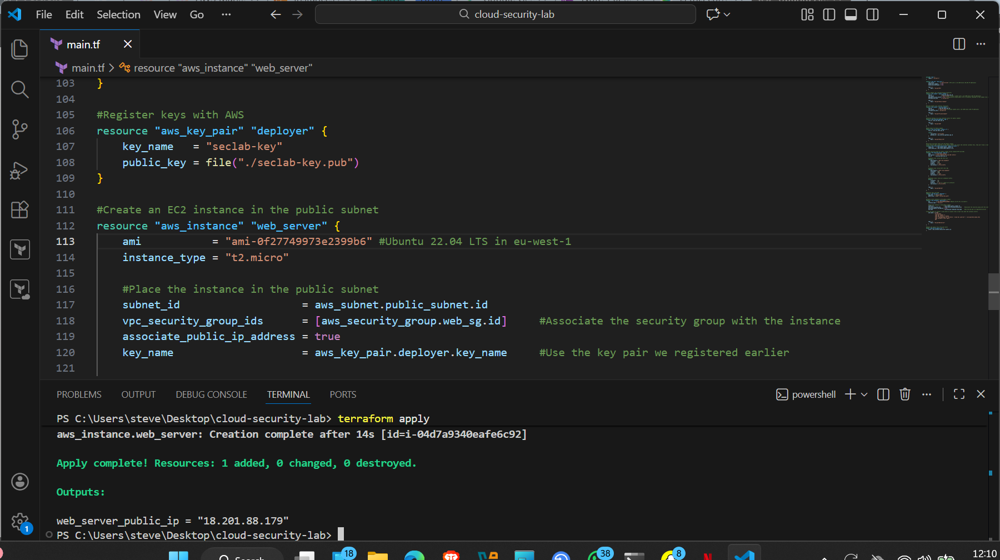
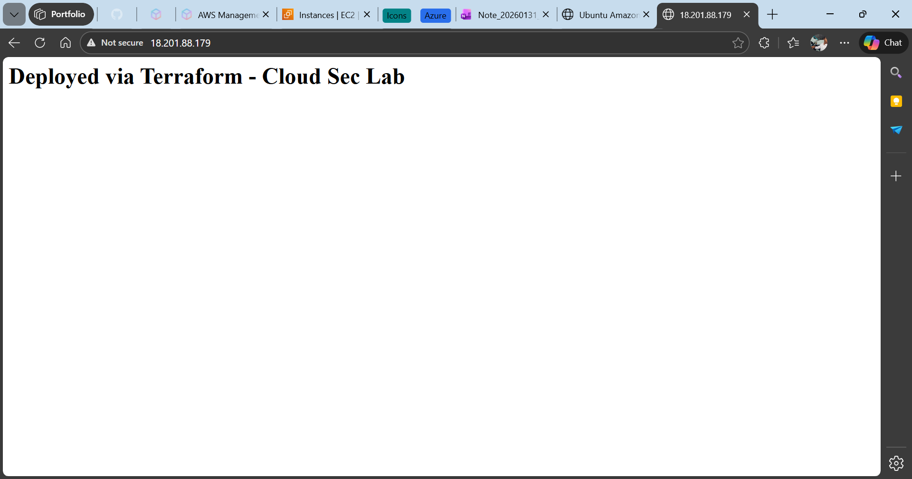

# AWS-Infrastructure as Code Security Automation

## Project Overview

Many cloud deployments focus on functionality while neglecting the security baseline, leading to easily exploitable "holes." This project demonstrates a **Security-First** approach to cloud infrastructure.

I used **Terraform** to architect a secure AWS VPC and then performed a deep-dive security audit using **Prowler** to identify and remediate critical misconfigurations. This project simulates the workflow of a Senior Cloud Security Engineer securing a production environment.

## Tech Stack & Tools

* **Cloud Provider:** AWS (VPC, EC2, IAM, IGW)
* **Infrastructure as Code:** Terraform
* **Security Auditing:** Prowler (Open-source CSPM)
* **OS/Environment:** Ubuntu 22.04 LTS, Nginx

## Architecture Design

The lab consists of a multi-layered network designed for isolation:

* **Public Subnet:** Hosts the Nginx Web Server with restricted Security Groups.
* **Private Subnet:** Isolated "Vault" for future database/internal workloads.
* **Internet Gateway:** Controlled egress/ingress point.
* **Security Groups:** Stateful firewalling (SSH/HTTP) restricted to specific CIDR blocks.

## Lab Execution Steps

### 1. Automated Deployment (Terraform)

Instead of manual configuration, I defined the entire stack as code to ensure repeatability and eliminate human error.

```hcl
# Deployment Command
terraform init
terraform plan
terraform apply -auto-approve

```

> **Screenshot:** Terraform VPC spin up using IaC
> 

> **Screenshot:** EC2 Ubuntu server via ssh
> 

> **Screenshot:** Launched server via private IP
> 

### 2. The Initial Audit

After deployment, I ran an audit using **Prowler** against the CIS AWS Foundations Benchmark.

* **Initial Status:** 99% Failure on EC2 / 93% Failure on VPC.
* **Key Findings:** Open SSH (22) to the world, unencrypted volumes, and missing Flow Logs.

> **Screenshot:** Automated CSPM via Prowler
> 

### 3. Remediation & Hardening

I went back into the Terraform code to fix the high-severity findings:

* Locked down SSH to a single Admin IP.
* Enabled encryption-at-rest for EBS volumes.
* Implemented "Least Privilege" for IAM roles.

[To be released in next episode content]

---

## 📬 Connect with Me

* **LinkedIn:** [(https://www.linkedin.com/in/kyrian-onyeagusi/]
* **Email:** [(mailto:c_kyrian@icloud.com]
